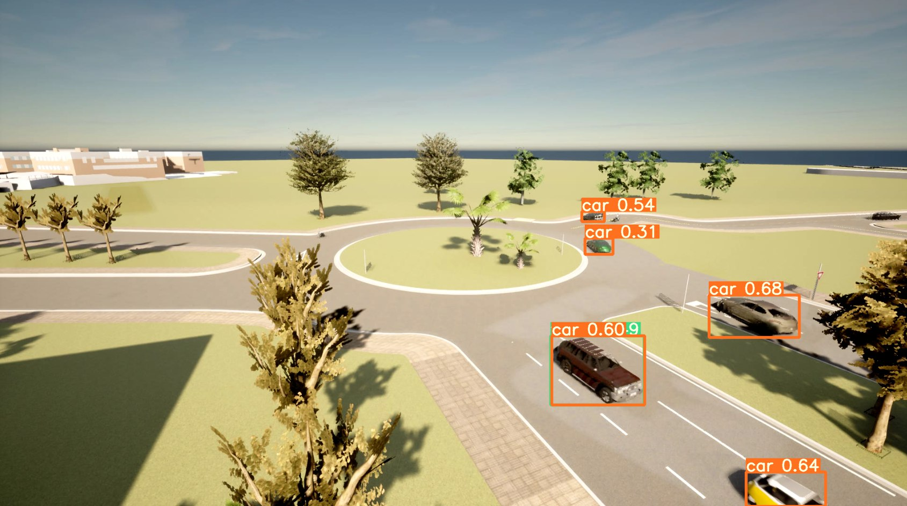
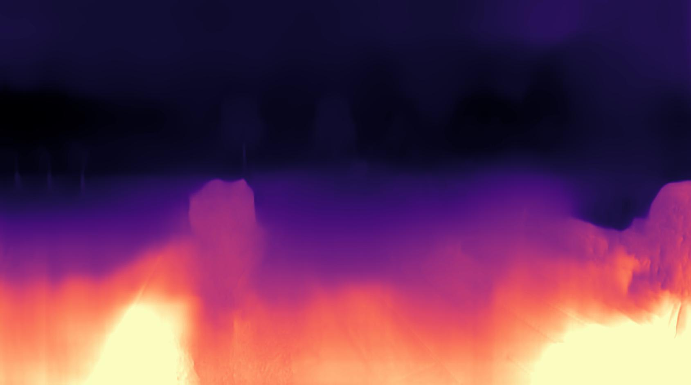
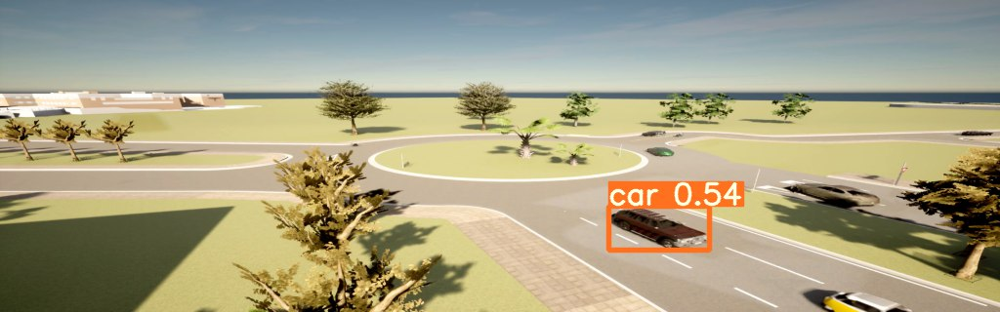
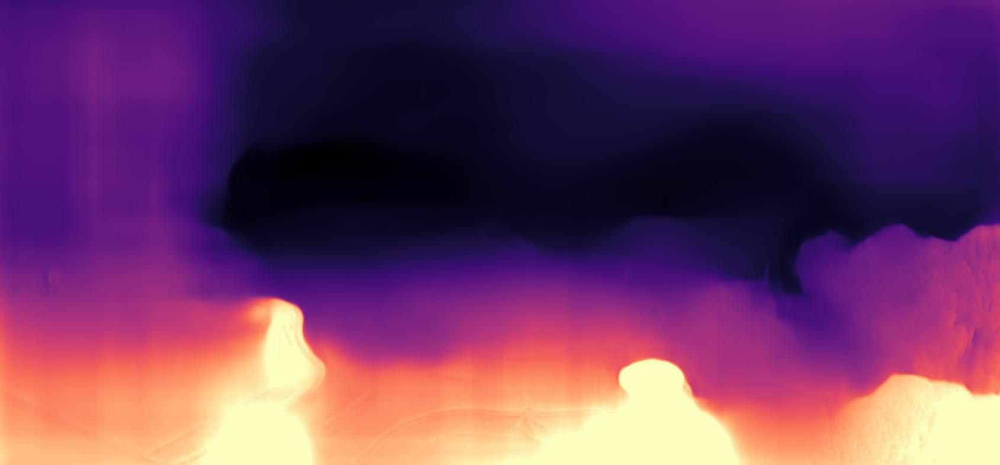
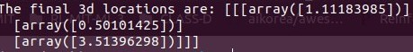

## A Brief summary on the work done in the First Phase.

In the first phase, I had initially started with literature review and testing out a few things. Following the literature review and sitting with the problem statement for some time, I had come to the conclusion that this problem can be solved to an extent by using a pipeline containing a detector network followed by a depth network to estimate the 3d locations. The reason to prefer this method over the the other methods is due to the perspective/point-of-view from which we get the data frames. Using pose estimation networks would give us the 2d pose and in the image and not the real world. And 3d pose netowrks havent shown effectiveness for our case. 

### Detector Network - YOLOv3:
For the detector network, we use the YOLOv3 pretrained networks as that contains the person and vehicle classes trained for the classificaation tasks and have been shown to work well. We take our data from the Carla simulator and use those frames as the input to our pipeline. The YOLOv3 network will output the bounding box, class probability and confidence of the detected class. Detection here is done in a single at 3 different scales and hence gives good performance and at satifactory speed. 

### Result of the Detector for our Data:

### Depth Network - Monodepth2:
For the detector network, we begin with the Monodepth2 network. This is preferred as the monodepth model returns metric depth. So, we can directly use the metric depth in our further computations, instead of worrying too much about the scale. We have experimented with the following four models:
1. mono_640x192
2. mono+stereo_640x192
3. mono_1024x320
4. mono+stereo_1024x320

Of these we gotten the best results for the mono+stereo_1024x320 model.

### Result of the Depth Network for our Data:

### 3D Location Prediction:

Once the depth data and the bounding box info has been obtained, the pixel coordinates of the central point of each bounding box of interest are computed and using the depth data and the intrinsic parameters of the camera, thee corresponding 3d location is computed. 

### Results of the location prediction:

- YOLO takes ~0.174s and monodepth takes ~3.61s for a single frame.
- Hence the total inference time of the pipeline to get the 3D location is around ~3.9s. 

## Problems faced and potential solutions:
The depth network model currently gives the output in 1024x320 resolution.Inorder to work with this, the input yolo is being downscaled which compromises the detection performance in this module. As a work-aroound, upsampling the depth map to the input dimension and making no compromises with the detection module had provided some relief to the issue.

## What Next?
- Consider LapDeth network to experiment with and see if the results are better than monodepth and if it is preferable.
- Upscaling the existing pipeline.

---

#### References

> [**YOLOv3: An Incremental Improvement**](https://arxiv.org/abs/1804.02767)

> **Digging into Self-Supervised Monocular Depth Prediction**
>
> [Clément Godard](http://www0.cs.ucl.ac.uk/staff/C.Godard/), [Oisin Mac Aodha](http://vision.caltech.edu/~macaodha/), [Michael Firman](http://www.michaelfirman.co.uk) and [Gabriel J. Brostow](http://www0.cs.ucl.ac.uk/staff/g.brostow/)
>
> [ICCV 2019 (arXiv pdf)](https://arxiv.org/abs/1806.01260)

> [**Monocular Depth Estimation Using Laplacian Pyramid-Based Depth Residuals**](https://ieeexplore.ieee.org/document/9316778)
---
