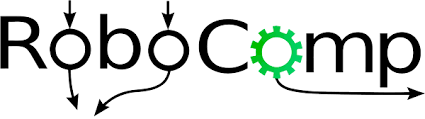
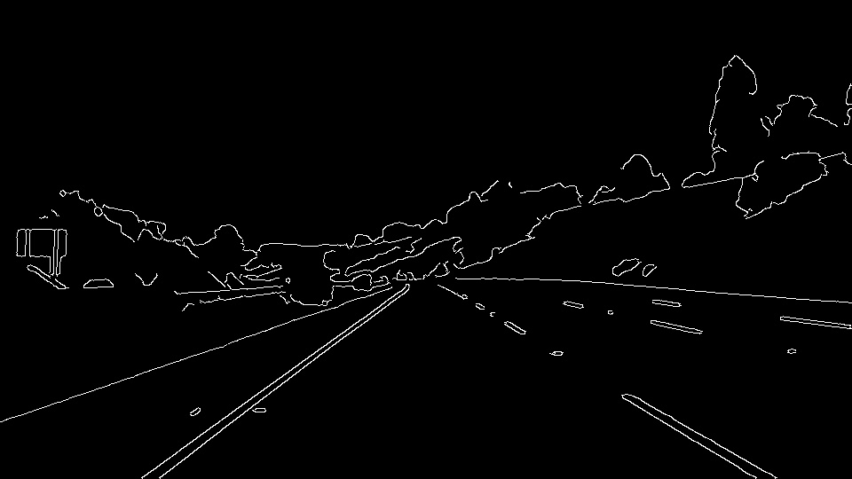
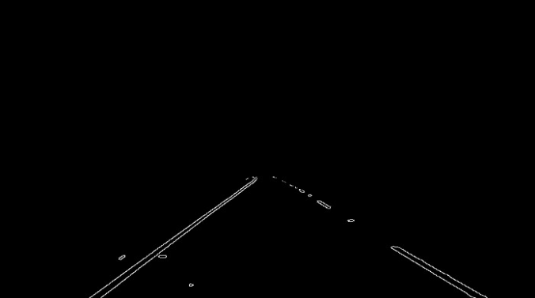

  

# **Finding Lane Lines**

**Finding Lane Lines on the Road**

When we drive, we use our eyes to decide where to go. The Lane lines on the road that shows us where the lanes are act as our constant reference for where to steer the vehicle. Naturally, one of the first things I would like to do in this project is to automatically detect lane lines using an algorithm.

https://user-images.githubusercontent.com/42083679/123698027-411e1680-d87b-11eb-959a-8989861c0b0f.mp4

In this project I detect lane lines in images using Python and OpenCV and later on video.  OpenCV means "Open-Source Computer Vision", which is a package that has many useful tools for analyzing images.  
Some steps include :-
1. Convert BGR image to Gray
2. Convert into Blurred image using Gaussian Filter(to avoid the noise)
3. Apply Canny Edge Detection into the image.
4. we define Region of interest(i.e. bottom half of the image)
5. Apply Hough Transform and smoothing the final detected lane lines.

The video above talks about how I go about processing the input stream and the steps involved to build an image processing pipeline that gives just two lines as outputs — one left lane and one right lane.

Let’s go through them in more detail along with the code here, starting with a picture of a highway below.

  

The first thing I did is to convert the color image into Gray (i.e. 3 channel image into 1 channel)

`cv2.cvtColor(img, cv2.COLOR_RGB2GRAY)`

  

Next step is to blur the image so that only truly contrasting parts of the picture stand out. This helps smooth out the overall numbers in the image matrix that defines this picture. The kernel_size is the amount of blur to be applied.

Note: By default kernel_size = 3 and always remember the value of kernel_size is an odd number.

`cv2.GaussianBlur(img, (kernel_size, kernel_size), 0)`

I apply the Canny Transform, which is a popular edge-detection algorithm. Here, it takes two threshold values to determine how little and how much change is acceptable to be considered a valid edge. This is an important parameter that I tweak to achieve the best possible results.

`cv2.Canny(img, low_threshold, high_threshold)`

  

Not all of the edges are important to us, so I mask out most of the image and only region of Interest i.e. the bottom part of the road in view.

`cv2.fillPoly(mask, vertices, ignore_mask_color)`

  

This is the most important step, I use the Hough Transform to convert the pixel dots that were detected as edges into meaningful lines. It takes a bunch of parameters, including how straight should a line be to be considered a line and what should be the minimum length of the lines. It also connect consecutive lines. I specify the maximum gap that is allowed. This is a key parameter for us to be able to join a dashed lane into a single detected lane line.

`cv2.HoughLinesP(img, rho, theta, threshold, np.array([]), minLineLength=min_line_len, maxLineGap=max_line_gap)`

  

# Final Output Video

https://user-images.githubusercontent.com/42083679/123699255-af170d80-d87c-11eb-96b4-cdeced84dbad.mp4

https://user-images.githubusercontent.com/42083679/123697674-ce14a000-d87a-11eb-9c8b-22cbb273a7c2.mp4

**Thank You**

