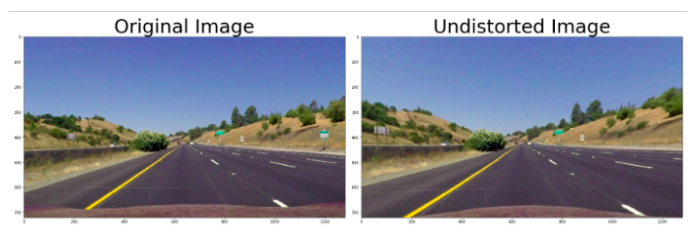
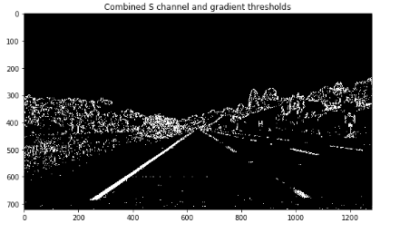
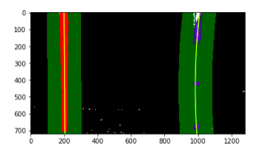

  

# **Advanced Lane Lines**

**Advanced Lane Finding on the Road**

Now I move towards the next very interesting steps of this project i.e Advanced Lane Line Detection using computer vision.
The video below talks about how I process the input stream and the steps involved to build an image processing pipeline that gives filling area between left lines and right lines as well as Curvature as outputs.

**Advanced Lane Finding Finding**

The goals / steps of this project are the following:

* Compute the camera calibration matrix and distortion coefficients of given images.
* Apply a distortion correction to raw images.
* Use color transforms, gradients, etc., to create a thresholded binary image.
* Apply a perspective transform to rectify binary image ("birds-eye view").
* Detect lane pixels and fit to find the lane boundary.
* Determine the curvature of the lane and vehicle position with respect to center.
* Warp the detected lane boundaries back onto the original image.
* Output visual display of the lane boundaries and numerical estimation of lane curvature and vehicle position.

Let’s go through them in more detail along with the code here, starting with a picture of a highway below.

  

## Camera Calibration

`Camera calibration is the process of estimating parameters of the camera using images of a special calibration pattern. … Use these camera parameters to remove lens distortion effects from an image, measure planar objects, reconstruct 3-D scenes from multiple cameras, and perform other computer vision applications.`

Once we have stored the correspondences between the 3D world and 2D image points for a bunch of images, I proceed to actually calibrate the camera through ‘cv2.calibrateCamera()’. Among other things, this function returns both the *camera matrix * and the *distortion coefficients*, which I use to distort the frames.

Once the camera is calibrated, I use the camera matrix and distortion coefficient to undistort also test images.

Camera calibration, given object points, image points, and the shape of the grayscale image:

`ret, mtx, dist, rvecs, tvecs = cv2.calibrateCamera(objpoints, imgpoints, gray.shape[::-1], None, None)`

where mtx = camera matrix and dist = distortion coefficient.
 
Now Undistorting a test image:

`dst = cv2.undistort(img, mtx, dist, None, mtx)`

  

## Color transforms, gradients or other methods to create a threshold binary image

Correctly creating the binary image from the input frame is the very first step of the whole pipeline that will lead us to detect the lane. For this reason, I found that this is one of the important steps. If the binary image is bad, it’s very difficult to recover and to obtain good results in the successive steps of the pipeline.

I used a combination of color and gradient to generate a binary image i.e. Sobel Gradient Threshold, Magnitude and Direction of the Gradient, different color spaces i.e. HSV, HLS AND BGR and I found S channel of HLS perform really well to detect lines.I employed a threshold on S channel in HLS color space. Furthermore, I also involve the input frame with sobel kernel to get an estimate of the gradients of the lines.

  

## Perspective transform

The function ‘calibration_utils.birdeye()’ takes as input the frame (either color or binary) and returns the bird’s -eye view of the scene. In order to perform the perspective warping,I need to map 4 points in the original space and 4 points in the warped space. For this purpose, both source and destination points.

Compute the perspective transform, M, given source and destination points:

`M = cv2.getPerspectiveTransform(src, dst)`

Warp an image using the perspective transform, M:

`warped = cv2.warpPerspective(img, M, img_size, flags=cv2.INTER_LINEAR)`

  

## Identified lane-line pixels and fit their positions with a polynomial

In order to identify which pixels of a given binary image belong to the lane-lines, I have (at least) two possibilities. If I have a brand new frame, and I never identified where the lane lines are, I must perform an exhaustive search on the frame. This search is implemented in ‘line_utils.get_fits_by_sliding_windows()’: starting from the bottom of the image, precisely from the peaks location of the histogram of the binary image, I slide two windows towards the upper side of the image, deciding which pixels belong to which lane-line.

On the other hand, if I am processing a video and I confidently identified lane-lines on the previous frame, I can limit our search in the neiborhood of the lane-lines I detected before: after all I am going at 30fps, so the lines won’t be so far, right? This second approach is implemented in `line_utils.get_fits_by_previous_fits()`.

  

## Calculated the radius of curvature of the lane and the position of the vehicles with respect to center

Offset from the center of the lane is computed in ‘computer_offset_from_center()’ as one of the step of preprocessing. The offset from the lane center can be computed under the hypothesis that the camera is fixed and mounted in the top mid point. In this case, I approximate the deviation from the lane center as the distance between the center of the image and the midpoint at the bottom of the image of the two lane-lines detected.

During the previous lane-line detection phase, a 2nd order polynomial is fitted to each lane-line using ‘np.polyfit()’. This function returns the 3 coefficient that describe the curve, namely the coefficient of both the 2nd and 1st order tems plus the bias. From this coefficients, following [this](http://www.intmath.com/applications-differentiation/8-radius-curvature.php) equation, I can compute the radius of curvature of the curve.

  

# Final Output Video

https://user-images.githubusercontent.com/42083679/125023912-6c83db00-e09d-11eb-8f9b-025388401428.mp4

**Thank You**
