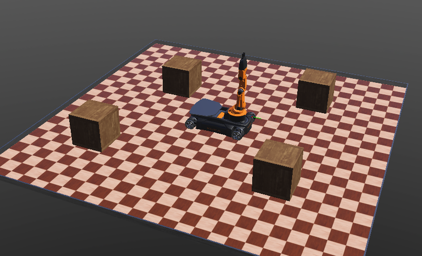
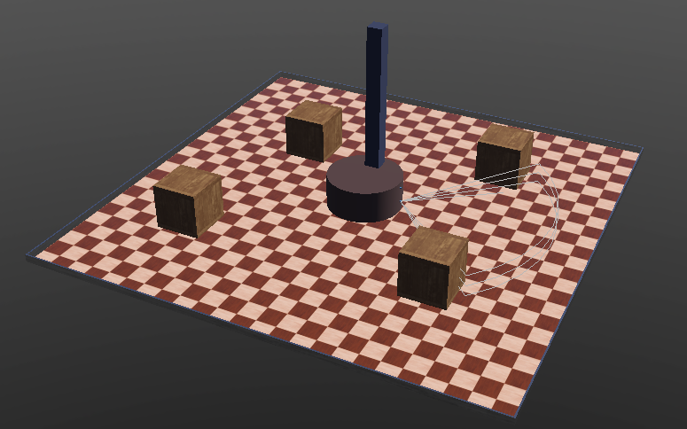

# Integrating RoboComp with Webots

## Introduction
Currently the world simulation is created with a python file that is a controller for an empty supervisor robot.
The world consists of simple rectangle arena, a robot and several boxes. The robot currently uses RoboComp components alongside with some void controllers.

## Setup I

This is an example of such simulation with a YouBot and additional Distance Sensor, which uses the Camera interface.

## Setup II

This is very similar example of such simulation with Ribbit instead. There are two sensors now, a Lidar and a Camera.

## Summary

This approach gives us opportunity to create simulation the way we want it to be using 'pre-made' code and there could be implemented more robots, objects or devices.
Everything can be moved or rotated as the user wants with very small changes in the code.

## What next?
- Add platforms or in other words controllers for different robot movement.
- Add a "brain" to the project that will be using RoboComp commands to steer the simulation.
- Add more devices or objects to increase the flexibility of the simulation.
