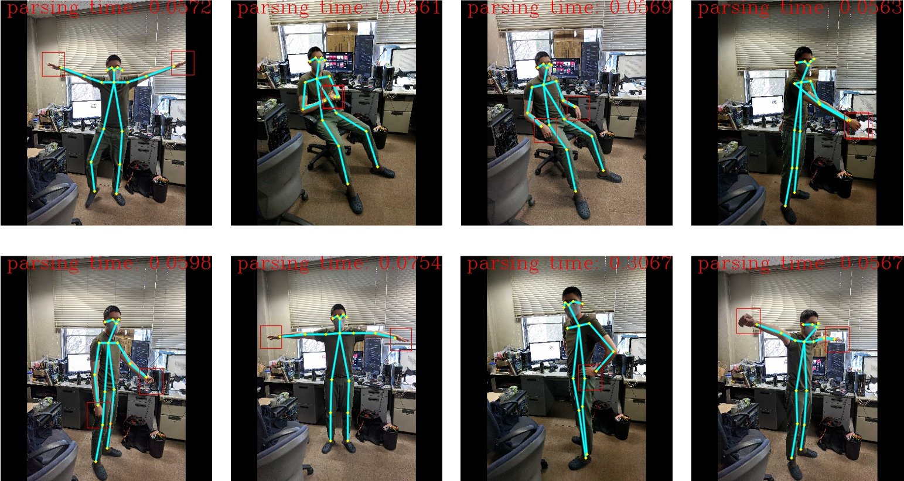

# GSoC'21 RoboComp project: Sign language recognition

19th June, 2021

## About me
Hi all, my name is Trung. Currently, I am a master student in Computer Science at the Tokyo university of 
Agriculture and Technology. This is my first time in GSoC, hope we will have a good summer.

I just start to learn about Robotic. This is my first step in this domain. 

**My hobbie** : Programming, swimming, practicing martial art, hiking.

## About the Project

The main topic can be divided into two parts:

* Body and hand detection: I apply the lightweight Openpose model, MediaPipe library, and the optical flow algorithm. The combination can process in real-time and with a lightweight model, so it is suitable for edge devices.
* Gesture recognition: There are two main approaches for this problem: image-appearance-based models and pose-based models. These two are different in types of input data. The first approach's input is only images, while the second one's input is extracted poses from photos.

Extension: Currently, the robot can only learn the gesture from the predefined patterns, which appear in the training data. However, the training dataset is not always available for all motions. Therefore, by applying some unsupervised techniques, the robot can recognize some gestures without any supervised dataset.

In this project: Four components will be published: BodyHandJointsDetector, ImageBaseGesture-Recognition, PoseBasedGestureRecognition, and UnsupervisedGestureRecognition. I will also code the testing client for each approach.

Link to pose detection project: https://github.com/rongtuech/handbodypose