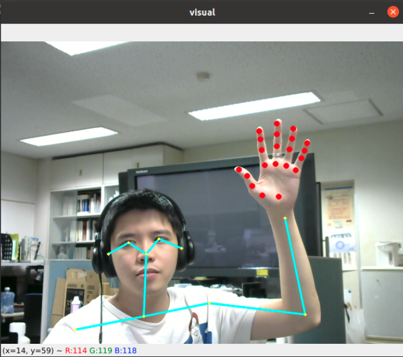

# GSoC'21 RoboComp project: Sign language recognition

29th July 2021

## Installation:
Both components are runned on Python3 environment. In order to ease the pain of installation, I use Anaconda virtual enviroment. Link: https://docs.anaconda.com/anaconda/install/index.html

The requirement libraries for running components:
+ cudatoolkit == 11.0.2
+ cudnn == 8.0.5
+ mediapipe == 0.8.x
+ opencv == 4.5.2
+ pyside2 
+ onnxruntime-gpu == 1.8.1 (should install with pip)
+ tensorRT == 8.0.1 (Should install with pip)
+ torchaudio == 0.7 
+ torchvision == 0.8   
+ pytorch == 1.7.x
+ zeroc-ice == 3.7.6
+ rich 
+ pycuda

## Usage:
### Body Hand pose detection:
The detector component is in robocomp-robolab/components/detection/BodyHandJointsDetector/
and its client is in robocomp-robolab/components/detection/test/bodyHandJointsDetectorClient/

Copy pretrained model from this link: https://drive.google.com/file/d/1W3Ud3u_55pJ0V4ODs47pne_OUKTDLkQa/view?usp=sharing
to src/_model/ in the detector component folder.

Steps:
1) Follow the introduction in the README.md to cmake the folder, and run the component. 
2) Run the detector before the client.

This client will get image from camera and send to detector and get back the body pose + hand joints and show as:

### Image based Sign language recognition:
The recognizer component is in robocomp-robolab/components/detection/imageBasedGestureRecognition/
and its client is in robocomp-robolab/components/detection/test/imageBasedGestureRecognitionClient/

Copy pretrained model from this link: https://drive.google.com/file/d/1VnCSZHCt69Cah7Xvf2D7P2Lfsx3L1Mqh/view?usp=sharing
to src/_model/ in the recognizer component folder.

Steps:
1) Follow the introduction in the README.md to cmake the folder, and run the component. 
2) Run the detector before the client.

This client will get image from camera and send to recognizer and get back the top 5 of action from nearest 64 frames.

