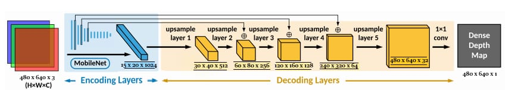

## ARCHITECTURE OF MobDepth:

* Input - Camera Frame (480,640,3) , Output - Depth Map (240,320,1)
* **Design Choices:**  
  1. Real-Time Estimation - As the model needs to predict in real time, thus a light-weight architecture is required.  
     As *MobileNet* uses least Number of Parameters without compromising on the Generalization, Thus it is used as Encoder. 
     
       
  2. Generalization and High-Quality Depth Map - *MobileNet* is Pre-trained on ImageNet Dataset and including *Skip-Connections* make it more generalizable, removing the problem of Vanashing Gradient.  
## SOME MORE RESULTS (on MobDepth(with Skip-Connections)):
a) Fig-1  

b) Fig-2  

## AUGMENTATION OF SIMULATOR DATA (coppeliaSim):
* To integrate the component with robocomp, model should give high quality depth map on Simulator data as well, obained using coppeliaSim. Thus, NYU dataset is Augmented with Simulator Data.

* Process of Data Collection of Simulator Data can be found in [Data-Collector](https://github.com/robocomp/grasping/tree/master/data-collector)

## FINE-TUNING USING COLLECTED SIMULATOR DATA:
* The Pre-Trained Model ("MobDepth (with Skip-Connections)") is trained further on collected simulator data to give high quality depth map in simulated world.

## RESULTS BEFORE AND AFTER FINE-TUNING:
a) Fig-1  

b) Fig-2  

     

