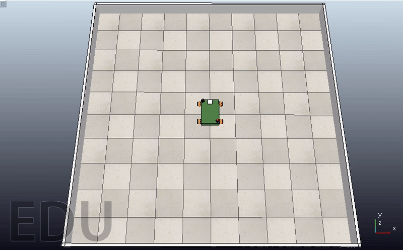

# GSoC'21 RoboComp project: Simultaneous path planning and following using Model Predictive Control (SPAF)

19th August, 2021

# Differential Robot
Many mobile robot use differential drive mechanism in their motion. By definition, it consists of two wheels mounted on a common axis, where each wheel must rotate about a point lying on it know as the Instantaneous Center of Curvature (ICC), and each wheel can be driven independently in a direction. The equations of the velocity for each side (right and left) can be described as follows: 


Knowing that "w" is the angular velocity, "R" the signed distance from the ICC to the midpoint between the wheels, and finally "l" is the distance between the centers of the two wheels.

Moreover, by studing the equation with respect to "R" and "w", we can deduce three senarios:


- When the two velocities are equal, the robot will move linearly (R is infinity).
- When the two velocities are equal in magnitude but opposed in direction, the robot will rotate in place.
- When only one velocity is equal to zero, the robot will rotate about one side wheel.

In order to switch between the omni-directionnal wheeled robot and the differential robot, a flag was added. intuitively, it sets the lower and upper bounds of a a velocity of a certain direction (i.e, X-direction). The condition sets the upper and lower bounds of Vx by zero.

```python

        if isDifferential:
            args['lbx'][h_states: h_states+h_controls: n_controls+1] = 0
            args['ubx'][h_states: h_states+h_controls: n_controls+1] = 0
```
This also can be proved mathematically. In order to satisfy the mecanum wheeled's inverse kinematic model,the trick lies on assuming two wheels instead of four. This will leads us to the same condition for the boundries.

```python
        # calculate mpc in world frame
        controlMPC = self.controller.compute(initialState, targetState, controlState, isDifferential=True)
```
# The Simulation
By giving the robot a point [1200,1800,0.5pi] as a target to compare the motion between differential mode and omni-directional mode.

1. **Differential Mode:**


2. **Omni-directionnal Mode:**


