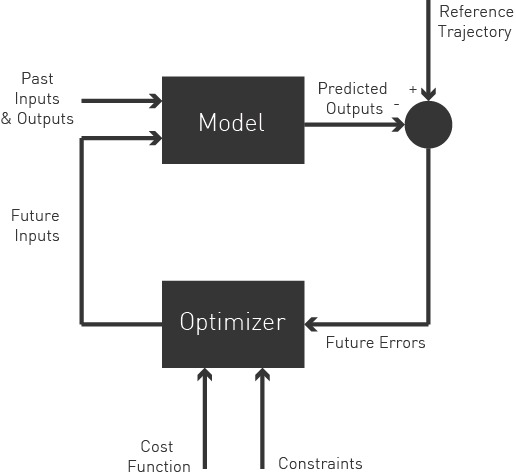

# GSoC'21 RoboComp project: Simultaneous path planning and following using Model Predictive Control (SPAF)

19th June, 2021

## About me
I’m a student at the faculty of Engineering, Alexandria University, 3rd year in the Electronics and Communication Department. My membership at M.I.A. Robotics (Technical Team at the college) steered me to deeply learn about Robotics with a high motivation to win international competitions. Being a software member and studying in electrical department led me to look for integrating hardware and software to develop useful solutions such as autonomous vehicles.

## About the Project
The field of Model Predictive Control (MPC) has seen tremendous progress. The algorithms and high-level software available to solve challenging nonlinear optimal control problems are significantly used in mobile robots to optimize in real-time their path following and navigation. In order to solve Non-Linear Programming Problems (NLP) – which is considered the general form –, we are using [CasADi](https://web.casadi.org/), an open-source framework  for solving non-linear optimization problems. Also, the robot should be able to avoid obstacles in real-time by taking into consideration some constraints and penalizing the control values as illustrated in the graph. In practice, previous maps and laser values are combined to create a list of convexified obstacle-free regions. To comply with the real-time requirements of a physical robot, the algorithm will be able to adapt – also in real-time – to the current situation by trading off between execution time and the number of constraints.
