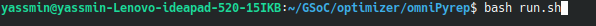
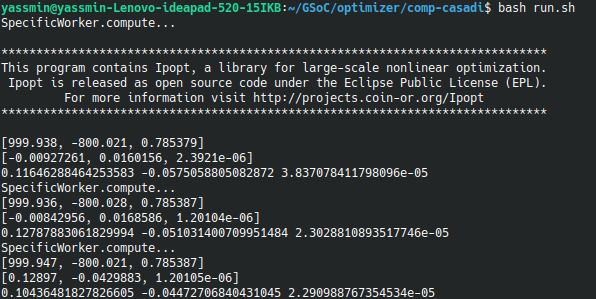
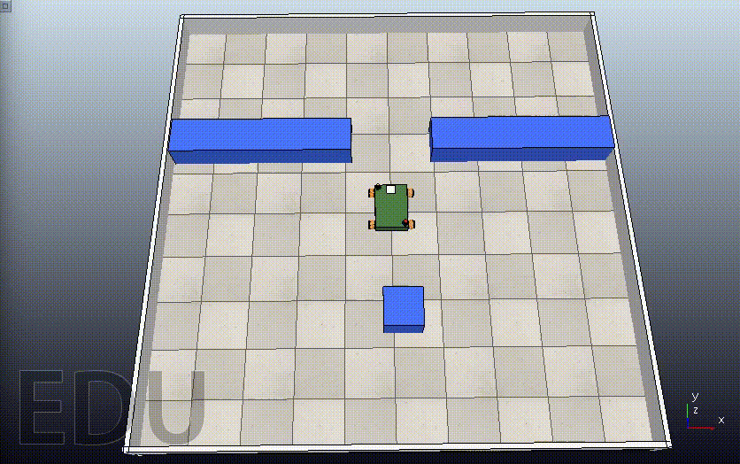

# GSoC'21 RoboComp project: Simultaneous path planning and following using Model Predictive Control (SPAF)

19th June, 2021

# Installation
To start, we need to install the following:
1. [Robocomp:](https://github.com/robocomp/robocomp)
2. [CoppeliaSim:](https://www.coppeliarobotics.com/)
3. [PyRep:](https://github.com/stepjam/PyRep)
4. [Optimizer components:](https://github.com/Yasmin-Hesham/optimizer)
Hints: 
 - Carefully follow the instructions listed in the readme files.
 - Install Robocomp first, then Pyrep and make sure that the “.bashrc” file    includes the correct paths of (Robocomp’s root, Coppeliasim’s root only).


# Optimizer
## How to get started
1. Pull the [Github Repo](https://github.com/Yasmin-Hesham/optimizer)
2. Build the component as described in the [tutorial](https://github.com/robocomp/robocomp/blob/development/doc/robocompdsl.md) by running in the component's path two commands:
   -  cmake . 
   -  make
3. To run the simulation on CoppeliaSim:
   - Run the “run.sh” in OmniPyrep from a terminal.
    
   - From another terminal, run the “run.sh” in comp-casadi.
    
## References
- [Robocomp Tutorials](https://github.com/robocomp/robocomp/blob/development/doc/README.md) for better understanding of the components. 
- [CasADi](https://web.casadi.org/) for more information about the optimizer.

## MPC for Point Stabilization
The optimizer component is the controller of the Viriato Robot to ensure better stabilization and smooth motion. It’s connected to other agents that send the data used to drive the robot autonomously. 
In order to start the project, we should create our own component that implements MPC, and also, it should interface with the “OmniPyrep” component for the simulation and hence, the testing phase. 
 
The optimizer is developed by using IPOPT solver from [CasADi](https://web.casadi.org/), using Python 3. IPOPT is a free open-source solver in [CasADi](https://web.casadi.org/) that solves NLP problems. 
The idea consists of feeding the NLP solver by the cost function, which is simply the evaluation of the cost running along the prediction horizon. And for better optimization, constraints and weights are added to penalize the control actions thus obtaining a better output flow. 

The MPC code consists of two files to be organized: 
- **MPCTools:** includes all the necessary vectors and parameters that are used for the model.
- **MPCModel:** includes the MPC’s functionality and MPC’c class that is used in the “specific_worker.py” file.
In “specific_worker.py”, a rotation matrix was added to transform the control states from the world’s frame to the robot’s frame which is the reference frame used in MPC. We pass three vectors to the MPC:
- The initial states (i.e. The initial values for the optimization of states along the prediction horizon.)
- The target states (i.e. The goal point to be reached.)
- The control states (i.e. The initial values for the optimization of control actions obtained from the previous iteration.)
And finally, it returns the optimal control actions’ vector as showing in the code in `specificworker.py`:

```   python
def compute(self):
        tic = time()
        print('SpecificWorker.compute...')
 
        # get current pose in world frame
        currentPose = self.omnirobot_proxy.getBaseState()
        
        rotMat = np.array([
            [cos(-currentPose.alpha), -sin(-currentPose.alpha), 0],
            [sin(-currentPose.alpha),  cos(-currentPose.alpha), 0],
            [0                      ,  0                      , 1]
        ])
 
        initialState = ca.DM([currentPose.x, currentPose.z, currentPose.alpha])
        controlState = rotMat @ ca.DM([[currentPose.advVx, currentPose.advVz, currentPose.rotV]]).T
        targetState = ca.DM([1000,-800,pi/4])
 
        # calculate mpc in world frame
        controlMPC = self.controller.compute(initialState, targetState, controlState)
        # apply speed
        vx, vy, w = list(np.array(controlMPC.full()).flatten()) 

        self.omnirobot_proxy.setSpeedBase(vx, vy, w)
        
        print(initialState)
        print(controlState)
        print(vx, vy, w)
 
        return True
 ```

# The Simulation
Giving the robot a target to reach, the output simulation shows the flow of the motion. For example, when setting `targetState = ca.DM([1000,-800,pi/4])`, the output is as follows.




