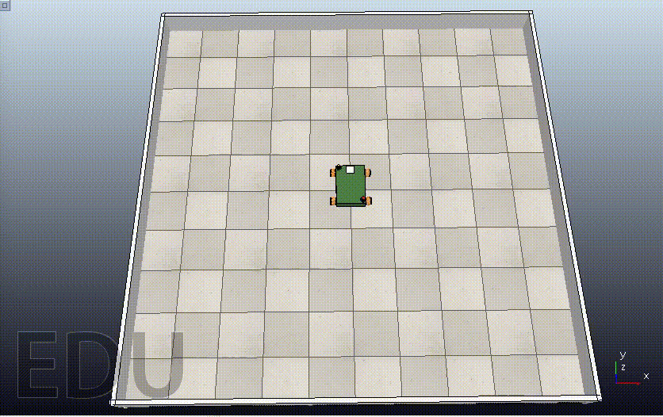

# GSoC'21 RoboComp project: Simultaneous path planning and following using Model Predictive Control (SPAF)


# Path Following
The path is a set of connected points that fit a line or a curve. By then, path following is a control task in which a geometric reference is to be followed without involving time as a constraint. From this intuitive idea, the path can be formed by a polynomial function of states, with a specific order. In other words, the states are a series of coefficients according to the path function's order.

An impressive and a brilliant idea was introduced in "Predictive Path Following of Mobile Robots without Terminal Stabilizing Constraints" paper. It introduces and spots the light on adding path parameter for the state and consider it a virtual state. The last shows the progress made upon the path; so in other words, it indicates how far the robot is from ending the predefined path. By consequence, a virtual control is produced, and it's considered the control action due to the virtual state's effect. 
Moreover, the overall system's states vector will be augmented for embodying the virtual state besides the robot's states. The same idea is also applied for the control vector.

Based on the following principles, the coefficients of the states in X and Y directions are passed to "compute" function to update the cost function according to the path parameter, state reference, and control reference.

```python
        controlMPC = self.controller.compute(
            initialState, X_COEFFS, Y_COEFFS, isDifferential=True)
```


# The Simulation
Giving the robot a set of points, and the order of the polynomials as a predefiend path. 
```python
POINTS = np.array([
    [   0,    0,  0],
    [   0, 1750,  0],
    [1750, 1750,  0],
    [1750,    0,  0],
    [1750,-1750,  0],
    [   0,-1750,  0]
])
```
1. **Differential Mode:**



2. **Omni-directionnal Mode:**


