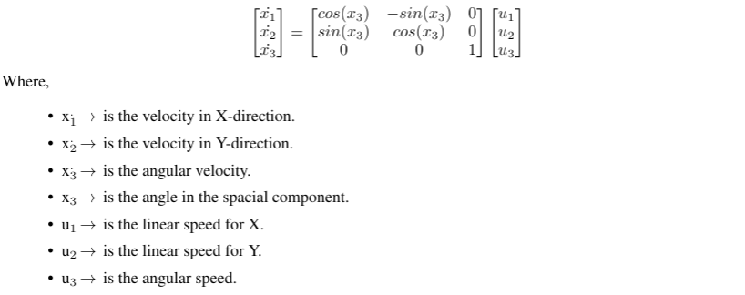
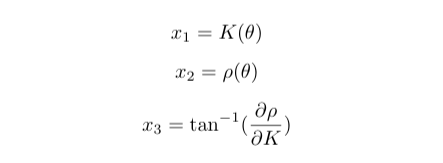

# GSoC'21 RoboComp project: Simultaneous path planning and following using Model Predictive Control (SPAF)

19th August, 2021

# Path Following
The path is defined as a set of connected points that fit a line or a curve. Then, the path following problem is a control task in which a geometric reference is to be followed without involving time as a constraint. Based on this intuitive idea, the path can be formed by fitting a polynomial function with a specific order to each of the states. In other words, each state is represented by a series of coefficients of the polynomial that defines this state.
We begin with the kinematic model for omni-directional robot:


And differentiate the states with respect to the path parameter since they are polynomial functions as follows:


An impressive and brilliant idea was introduced in "Predictive Path Following of Mobile Robots without Terminal Stabilizing Constraints" paper. It introduces and spots the light on adding a path parameter to the states and treat it as virtual state. This additional state indicates the progress of the robot along the predefined path. Similarly, a virtual control is also introduced. It is considered the control action that governs the virtual state's change rate.

Based on the previous principles, the coefficients of the states in X and Y directions are passed to "compute" function to update the cost function according to the initial state, state reference, and control reference. Also, the change in control action is penailized to have a smooth transition of control values.

```python
        controlMPC = self.controller.compute(
            initialState, X_COEFFS, Y_COEFFS, isDifferential=True)
```
# The Simulation
Giving the robot a set of points, and the order of the polynomials as a predefiend path. 
```python
#      X     Y  Phi
POINTS = np.array([
    [   0,    0,  0],
    [   0, 1750,  0],
    [1750, 1750,  0],
    [1750,    0,  0],
    [1750,-1750,  0],
    [   0,-1750,  0]
])
```
1. **Differential Mode:**


2. **Omni-directional Mode:**


