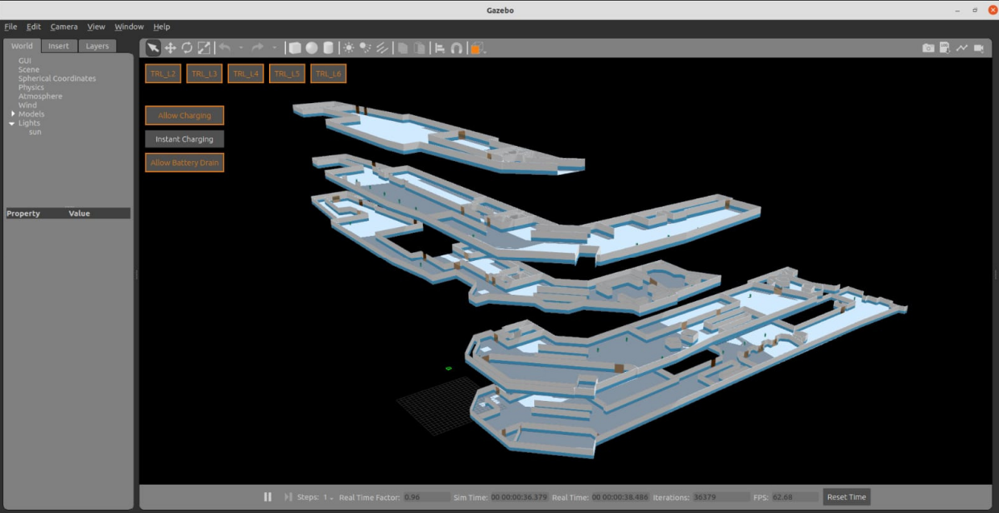

# GSoC'22 RoboComp project: Development on OSRF’s traffic editor

6th June 2022

## About me

Hello! I'm [samuel :D](https://www.linkedin.com/in/samuel-ang-025a81149/), a 3rd year mechanical engineering student at Nanyang Technological University. I've been a huge fan of robots from a very young age. While debugging might be painful at times, the feeling of watching software and hardware work seamlessly together never gets old!

I've had much experience working both on the hardware and firmware of robots. From 3D modelling to micro-controller programming, every aspect of robotics has fascinated and intrigued me. In the past year, I've been testing and integrating [Robotics Middleware Framework](https://github.com/open-rmf/rmf) (RMF) to a [public library](https://github.com/TRL-RMF) at my internship at GovTech. This involved the extensive use of [OSRF's traffic editor](https://github.com/open-rmf/rmf_traffic_editor). While it has been an amazing tool for in the creation of ```.world``` files, it still has many features which can be developed on that will make it an even better tool!

 


## About the Project
The [traffic editor](https://github.com/open-rmf/rmf_traffic_editor) is a set of tools to auto-generate simulation worlds from annotated 2D floor plans with building infrastructure information. The tool was developed for RMF to work in these generated worlds.

This project intends to extend the usage of traffic editor to the generation of simulation environments for outdoor robotics (i.e. self-driving cars). I am expected to make the necessary changes to the tool in order to process outdoor data and generate suitable simulation environments for the specific needs of those types of robots.


__Samuel Ang__
